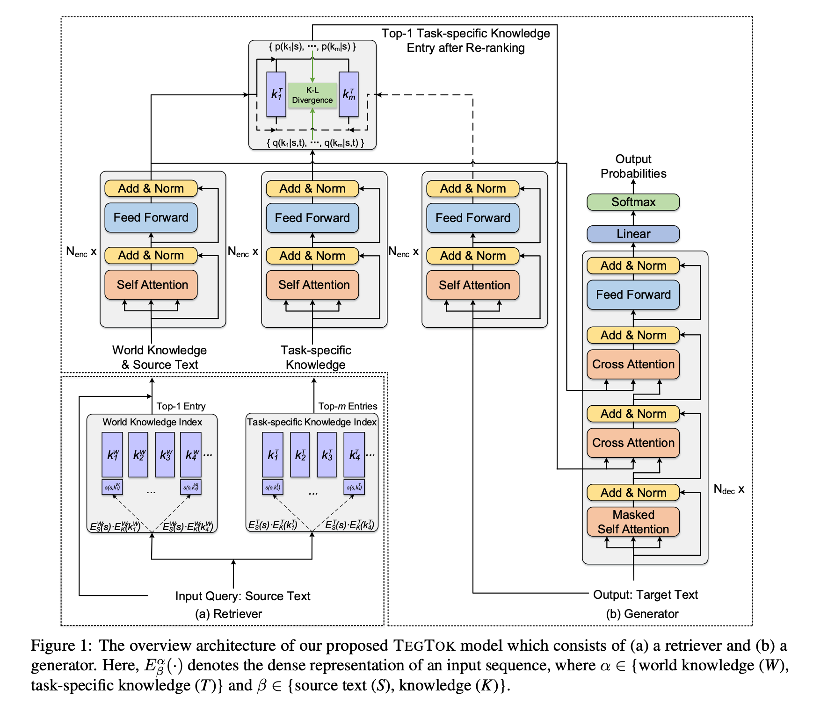
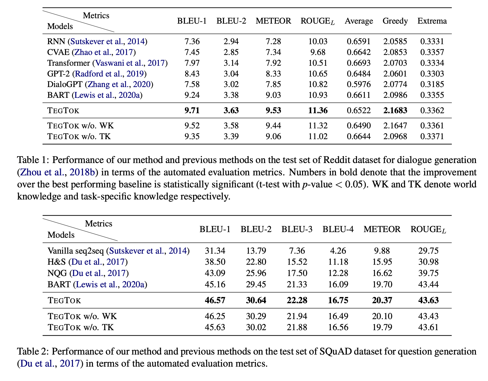

# TegTok: Augmenting Text Generation via Task-specific and Open-world Knowledge
This repository contains the source code for the _Findings of ACL 2022_ paper [TegTok: Augmenting Text Generation via Task-specific and Open-world Knowledge](https://arxiv.org/pdf/2203.08517.pdf). Chao-Hong Tan, Jia-Chen Gu, Chongyang Tao, Zhen-Hua Ling, Can Xu, Huang Hu, Xiubo Geng, Daxin Jiang. <br>
Hopefully, code will be released at the beginning of May. Thanks for your patience. <br>


## Introduction
Generating natural and informative texts has been a long-standing problem in NLP. Much effort has been dedicated into incorporating pre-trained language models (PLMs) with various open-world knowledge, such as knowledge graphs or wiki pages. However, their ability to access and manipulate the task-specific knowledge is still limited on downstream tasks, as this type of knowledge is usually not well covered in PLMs and is hard to acquire. To address the problem, we propose augmenting TExt Generation via Task-specific and Open-world Knowledge (TegTok) in a unified framework. Our model selects knowledge entries from two types of knowledge sources through dense retrieval and then injects them into the input encoding and output decoding stages respectively on the basis of PLMs. With the help of these two types of knowledge, our model can learn what and how to generate. Experiments on two text generation tasks of dialogue generation and question generation, and on two datasets show that our method achieves better performance than various baseline models.

<div align=center></div>

<div align=center></div>


## Update
Please keep an eye on this repository if you are interested in our work.
Feel free to contact us ({chtan, gujc}@mail.ustc.edu.cn) or open issues.

## Cite

```bibtex
@inproceedings{DBLP:journals/corr/abs-2203-08517,
  author    = {Chao{-}Hong Tan and
               Jia{-}Chen Gu and
               Chongyang Tao and
               Zhen{-}Hua Ling and
               Can Xu and
               Huang Hu and
               Xiubo Geng and 
               Daxin Jiang},
  title     = {{TegTok}: Augmenting Text Generation via Task-specific and Open-world Knowledge},
  booktitle = {Findings of the 60th Annual Meeting of the Association for Computational
               Linguistics, {ACL} 2022, Dublin, Ireland, May 22-27, 2022},
  publisher = {Association for Computational Linguistics},
  year      = {2022},
  url       = {https://arxiv.org/pdf/2203.08517.pdf},
}
```
